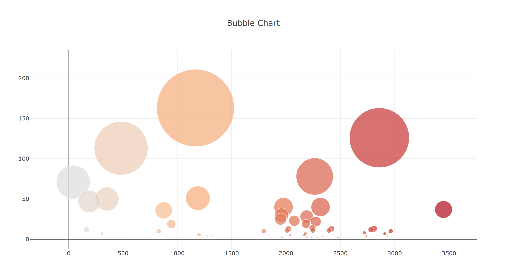

Use the D3 library to read in samples.json.

**Create a horizontal bar chart with a dropdown menu to display the top 10 OTUs found in that individual**

Use sample_values as the values for the bar chart.

Use otu_ids as the labels for the bar chart.

Use otu_labels as the hovertext for the chart.

**Create a bubble chart that displays each sample.**

Use otu_ids for the x values.

Use sample_values for the y values.

Use sample_values for the marker size.

Use otu_ids for the marker colors.

Use otu_labels for the text values.

**Display the sample metadata, i.e., an individual's demographic information.**

Display each key-value pair from the metadata JSON object somewhere on the page.

Update all of the plots any time that a new sample is selected.

**Adapt the Gauge Chart from https://plot.ly/javascript/gauge-charts/ to plot the weekly washing frequency of the individual**

Update the chart whenever a new sample is selected.

